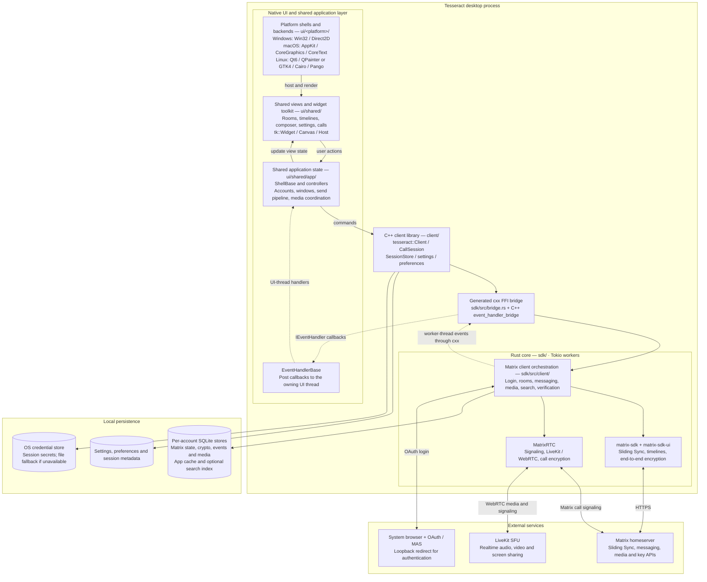
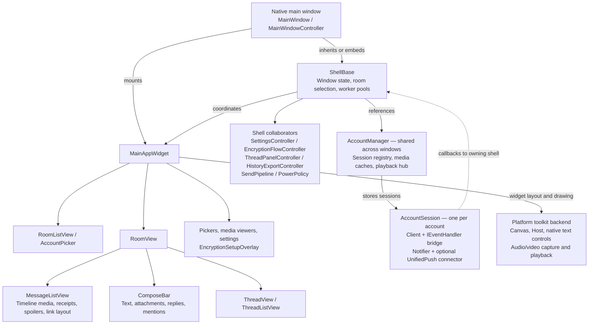
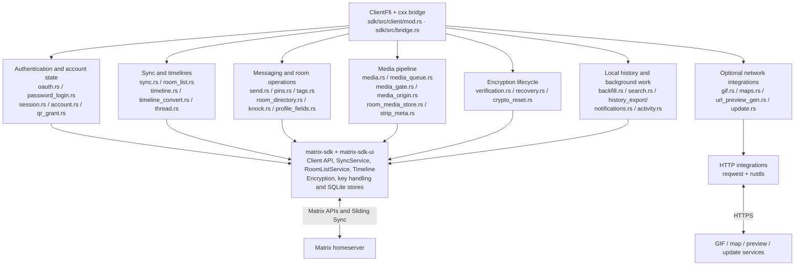
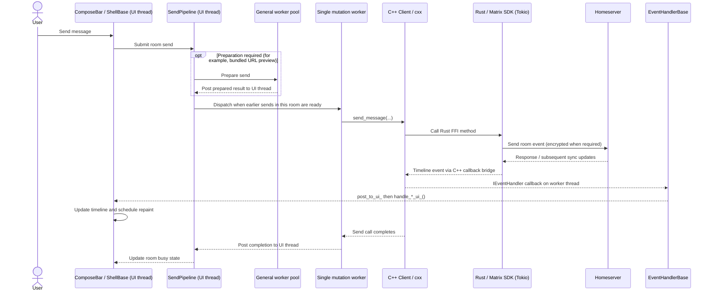
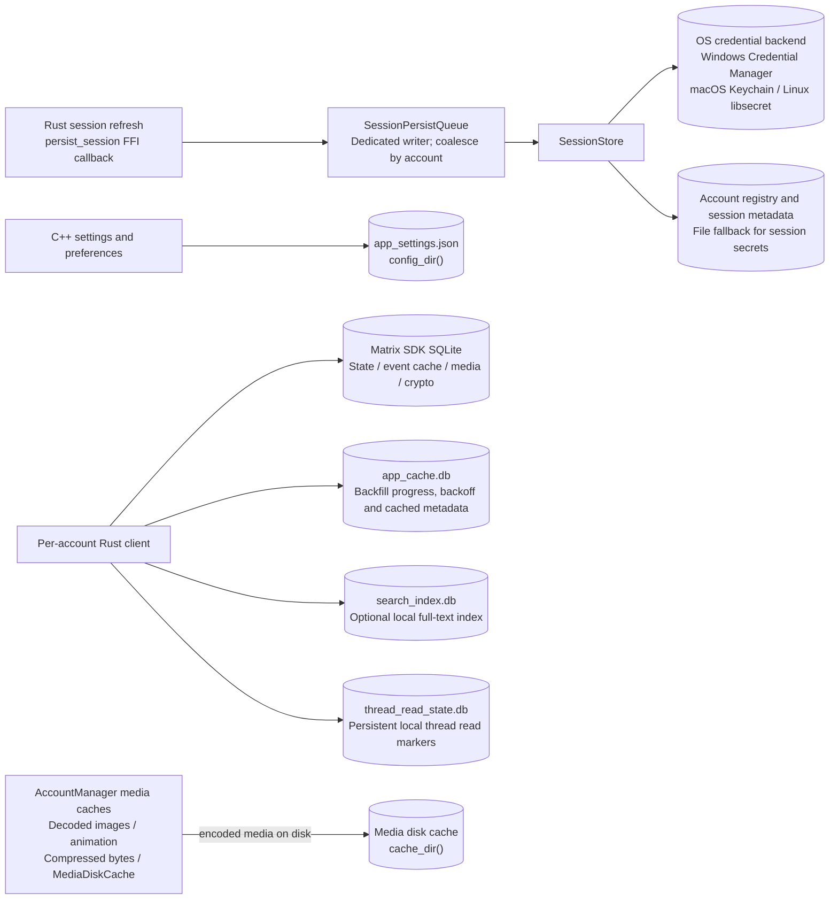
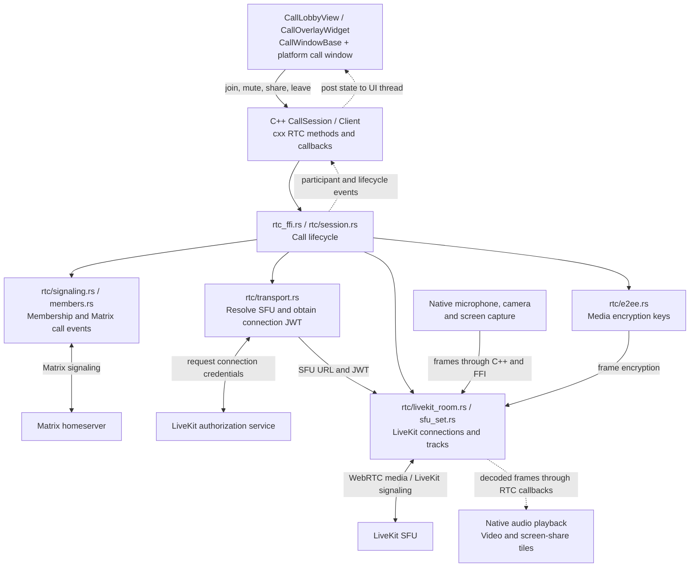
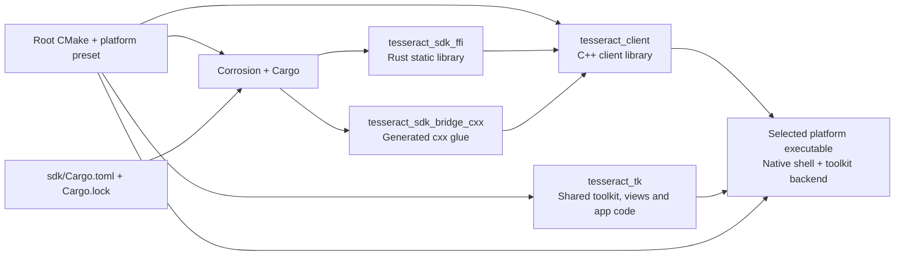

# Tesseract architecture

Tesseract is a native desktop Matrix client. Each platform executable combines
shared C++ views and application logic with a Rust networking core in the same
process. The diagram shows the main runtime boundaries; arrows describe calls
or data flow, and dotted arrows show asynchronous event delivery.

The platform shells supply native windows, menus, accessibility, notifications,
and toolkit backends. Shared views use the toolkit abstractions, while
`ShellBase` and its controllers coordinate accounts and application behavior.
The platform shells inherit from `ShellBase`; macOS embeds a derived `MacShell`
inside its Objective-C++ window controller. `ShellBase` is implemented across
`ShellBase_<subsystem>.cpp` files (accounts, calls, encryption, media, navigation,
rooms, search, settings, spaces, timeline, windows and view wiring); its worker
pool, account-lifecycle types, media types and pure helpers are separate headers.

Commands cross the C++ client API and the generated `cxx` bridge into Rust.
Background sync and other asynchronous work run on Tokio workers. Events return
through the C++ `IEventHandler` interface and `EventHandlerBase`, which posts them
to the owning platform's UI thread before updating application and view state.
Some API calls block, so the shared application layer also uses worker threads.

Matrix state and encryption data are stored per account. C++ session persistence
uses the OS credential backend, with a file fallback when it is unavailable.
OAuth opens the system browser and uses the SDK's loopback redirect listener;
legacy password login is an optional build feature. Calls use Matrix for
signaling and LiveKit/WebRTC for realtime media. Optional integrations such as
GIF search, maps, URL previews, update checks, and UnifiedPush are omitted here
to keep the main architecture readable.

## UI composition and account ownership

This diagram separates view composition from application ownership. The
`AccountManager` is shared across windows; each account has its own C++ client,
Rust runtime, Matrix client, and event bridge. Switching the active account
rebinds the window's views. Moving an account to another window retargets its
event bridge to that window's shell.

Native `Host` implementations provide UI scheduling and platform integration.
`Canvas` implementations draw shared widgets; native text controls support IME
and selection while their rendered surfaces participate in toolkit compositing.
Additional room and call windows use `RoomWindowBase` and `CallWindowBase`.

## Rust services and protocol responsibilities

These are logical groups of modules in one Rust crate, not separate processes.
`ClientFfi` holds the per-account runtime and client state. The bridge defines
the cross-language types and callable methods; `client/` converts those into
the public C++ API.

`start_sync` installs long-lived watchers for room lists, timelines, session
refresh, notifications, presence, recovery, and verification, and monitors the
sync service with reconnect backoff. Timeline conversion maps SDK events into
the types consumed by C++ views. Local backfill and search complement the live
sync stream. Optional integrations are feature- or preference-dependent.

## Threading and message flow

The UI thread owns widgets and window state. `ShellBase` has a general worker
pool for reads and preparation, a single worker for mutating FFI calls, and a
separate media-prefetch pool. Rust performs asynchronous work on each account's
Tokio runtime. The following sequence shows a typical text send and the event
path back to the view; it abstracts SDK-local echoes and later server updates.

Preparation can run concurrently, but `SendPipeline` preserves submission order
within a room. A room waiting for preparation does not hold up another room's
ready sends; the mutation worker still serializes the actual mutating calls.
Callback timing and API completion can interleave, so rendering is driven by
posted events rather than assuming one response equals one final timeline row.
Posted continuations use liveness guards to avoid updating destroyed windows.

## Persistence and cache boundaries

Session persistence bypasses the UI callback path: the dedicated writer prevents
credential-store and atomic-file writes from blocking sync workers. Pending
refreshes for the same account are coalesced so the newest session wins.

Account data lives beneath `data_dir()`; global application settings use
`config_dir()`. These roots coincide on Windows and macOS and differ on Linux.
Matrix SDK stores are distinct from the UI's decoded-image and disk caches.
The local thread read database is also separate from the disposable app cache.
The clear-cache path preserves crypto/session data and thread read state;
logout and other explicit reset operations have different cleanup scopes.

## Native calling

Call control, capture, transport, and rendering are separate responsibilities.
Matrix carries call membership/signaling; the authorization service supplies
credentials for LiveKit, whose SFU carries realtime media. RTC callbacks run on
worker threads, so UI state changes must be posted to the UI thread.

## Build composition

Linux can build both Qt6 and GTK4 executables using the same shared layers.
Platform-specific toolkit implementations compile into their platform targets.
The Rust and C++ layers are linked into the desktop application; the FFI boundary
is an in-process language boundary, not an IPC or network service.

## Source map

| Component | Entry points |
| --- | --- |
| Shared application and callback dispatch | [ShellBase.h](../ui/shared/app/ShellBase.h) (implemented in `ShellBase_*.cpp`), [EventHandlerBase.h](../ui/shared/app/EventHandlerBase.h) |
| Shared views and toolkit | [ui/shared/views](../ui/shared/views/), [ui/shared/tk](../ui/shared/tk/) |
| Platform shells and backends | [Windows](../ui/windows/), [macOS](../ui/macos/), [Qt6](../ui/linux-qt/), [GTK4](../ui/linux-gtk/) |
| C++ API and event bridge | [client.h](../client/include/tesseract/client.h), [event_handler_bridge.cpp](../client/src/event_handler_bridge.cpp) |
| Rust FFI and orchestration | [bridge.rs](../sdk/src/bridge.rs), [client/mod.rs](../sdk/src/client/mod.rs) |
| Authentication and persistence | [oauth.rs](../sdk/src/oauth.rs), [session.rs](../sdk/src/client/session.rs), [session_store.cpp](../client/src/session_store.cpp) |
| Native calls | [CallSession.cpp](../client/src/CallSession.cpp), [rtc](../sdk/src/client/rtc/) |

CMake builds the C++ targets and uses Corrosion to build and link the Rust static
library and generated bridge. See [BUILD.md](BUILD.md) for build configuration.
The diagram renders in Markdown viewers with Mermaid support, including GitHub.
