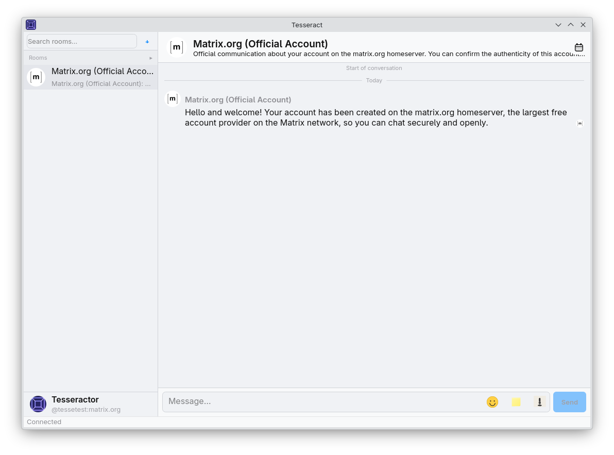
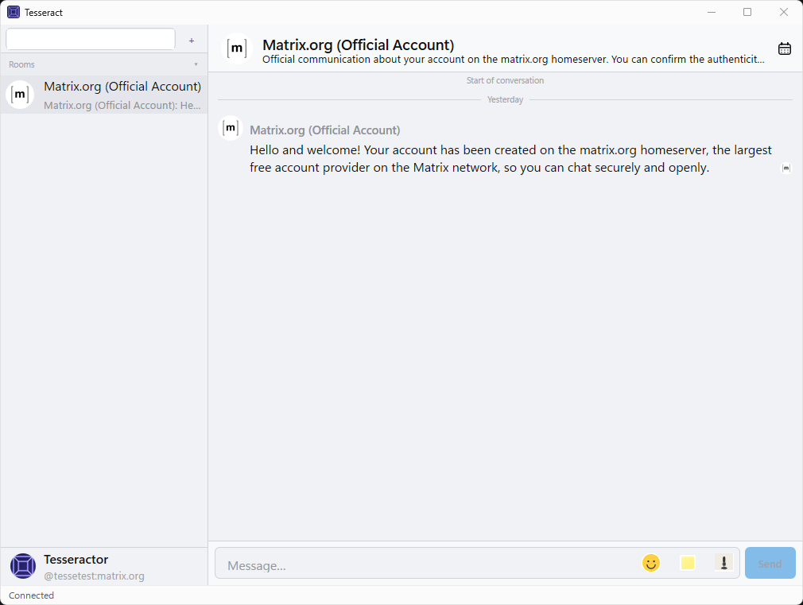
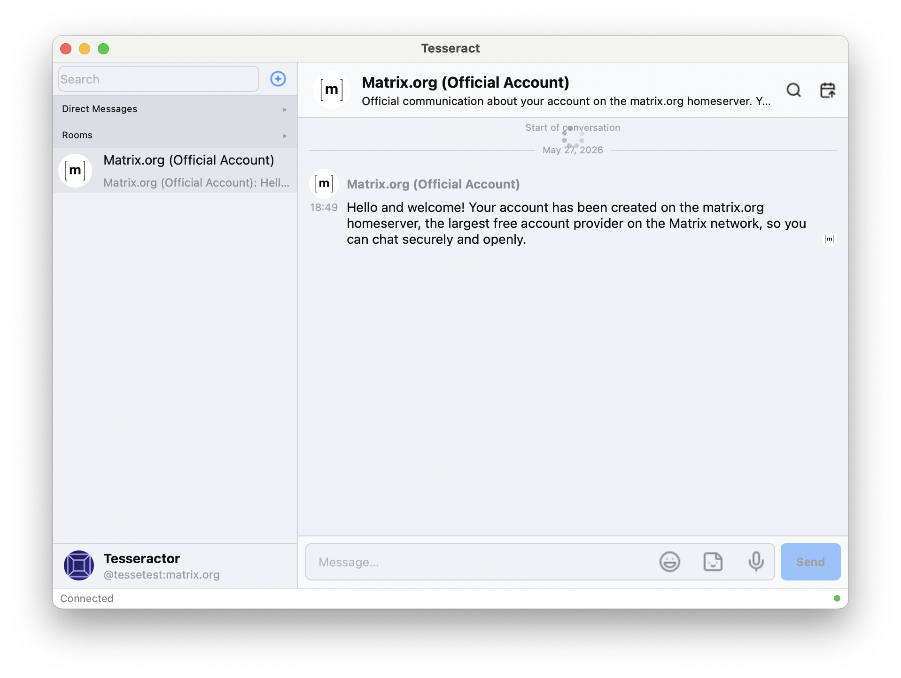

# Tesseract

> The native desktop Matrix client you always wanted.

(If you don't know what Matrix is - not THE matrix, unfortunately, no one can be told what that is - go [here](https://matrix.org/) before reading forward)

A full featured desktop multiplatform (Linux, Windows, Mac) Matrix client built on the [Matrix Rust SDK](https://github.com/matrix-org/matrix-rust-sdk)

---

## Why Tesseract?

- **Truly native client on four platforms: Linux (Qt6 & GTK4), Windows and macOS.**
- **Multi account support**
- **All the fun details and functionality of popular chat apps.**

---

## Screenshots

| Linux (Qt6) | Windows | macOS |
|---|---|---|
|  |  |  |

## Features

### Messaging

- Send, receive, edit, reply, react, and redact
- Markdown formatting (send and receive), with syntax-highlighted code blocks
- Custom emoji and reactions (image packs, MSC2545)
- Threads
- Pinned messages (pin / unpin, with power-level checks)
- Mentions with `@` autocomplete and rich pills; `:emoji:` shortcode autocomplete
- Read receipts (public and private), typing indicators, fully-read markers
- Day separators and new-message markers
- Automatic decryption retry as keys arrive — no permanent "unable to decrypt" placeholders

### Media

- Images, video, voice messages, audio, and files — send and receive
- GIF search and send via `/gif` (animated preview strip in the picker; works in encrypted rooms)
- Animated GIF / WebP / APNG in the timeline
- Animated stickers, including bridged stickers
- Media captions
- Send images by clipboard paste or drag-and-drop
- Thumbnail-first loading, with an optional automatic full-media fetch
- Zoomable / pannable image viewer
- Inline audio player with voice-message waveforms
- Download any file, image, or video
- URL previews

### Rooms & navigation

- Room list with Favorites, DMs, Rooms, and Spaces (tag-aware)
- Sticky, collapsible section headers
- Space and subspace navigation
- Open multiple rooms in tabs and/or separate windows
- Back / forward room history (Alt+Left / Alt+Right; ⌘[ / ⌘] on macOS)
- Automatic grouping of inactive rooms (configurable)
- Jump-to-date with a calendar picker (if supported by server)
- Unread indicators and last-message previews (including media)
- Auto-scroll to the most-recent unread room when new messages arrive (optional)
- Direct messages
- Ctrl+K quick switcher
- Room search (filter by name)
- Slash commands (/me, /shrug, /slap, /spoiler, /myroomnick, /myroomavatar, /join, /leave, /invite, /gif)
- Room tags (favorite, low priority)

### Security & privacy

- End-to-end encryption with emoji (SAS) device verification
- Key backup recovery and room-key export / import
- Initial encryption setup for new accounts
- OS-native secure credential storage on every platform
- Privacy controls, including presence send/poll toggles
- Device & session management
- MSC4278 media preview controls
- Cryptographic identity reset
- Clear-cache action (leaves the crypto/session store intact)

### Notifications

- Native desktop notifications with inline media
- Unified Push on Linux
- Per-room notification settings (mute / mentions / all)
- Respects your server-side push rules

### Platform integration

- System tray with unread/mention indicator and minimize-to-tray (clicking the icon jumps to the first unread room)
- Multi-account, with profile editing (display name and avatar)
- Single-instance behavior (relaunching restores the running window)
- Session restore (all open room tabs and the active account)
- In-flight request indicator in the status bar
- Light / dark / system themes

## Minimum OS requirements

| Platform | Minimum OS | Architecture |
| -------- | ---------- | ------------ |
| Windows (Win32) | Windows 10 version 1607 (Anniversary Update) | x86-64 |
| macOS (AppKit) | macOS 11 Big Sur | Apple Silicon (arm64) or Intel (x86-64) |
| Linux — Qt6 | Debian 12 (Bookworm) / Ubuntu 24.04 LTS or newer | x86-64 |
| Linux — GTK4 | Debian 12 (Bookworm) / Ubuntu 22.04 or newer | x86-64 |

---

## A note on how this was built

I've been a developer for more than 20 years, ran my own homeserver for more than 8, and developed a few things here and there in the matrix ecosystem (hello, encrypted sticker support on Element X!). I am also a bit tired of everything being a bloated web app (with all the respect to the element web guys), so I decided it was time to do something about it. I mean, seriously. Does EVERYTHING need to be a browser?

This started as a Claude Code experiment, because eventually I gave up and decided to learn what all this fuss was about, at least to be less worried about being out of a job, if that ever happens. So I thought: what was the app I always wanted to do my way and never had the time and/or energy? Yes! A Matrix client, of course.

So I paid for a month of Claude Max and set myself to see if I could create a full blown Matrix client in that time. Apparently, it can be done, but I don't recommend it; it can be quite time consuming anyway.

It's important to point out that EVERYTHING related to the matrix protocol and communication with the homeserver goes through the matrix-rust-sdk. I didn't set to reimplement the protocol, or encryption, or any of the most sensitive parts of a matrix client, because that would be stupid, and we have this awesome piece of code already written by humans way smarter than any LLM.

I used Claude to write everything else: a C++/Rust bridge to be able to use the SDK from a shared toolkit library and the four platform-specific thin shells.

If you don't like or trust AI-assisted developed apps, that's fine. I'm not sure I do, but this one I made, reviewed the code, and I'm kinda sure what it's doing inside.

Bottom line, I made this little client, and I barely open element these days, which was sort of the point. The code is open, you can see everything, and any positive contribution/criticism is welcome.

---

## Project status

The app is mostly complete and can be used for existing accounts and new accounts. I'm curious to see if there is any interest for it out there. I expect to keep polishing it and updating it as the matrix spec evolves. But I do have a day job, and it's not this one :) So I can't promise things are going to be fixed immediately.

There are a few things missing here and there, but I plan to add them as soon as I can.

Also I don't speak as many languages as I would like to, so translations are a bit lagging behind. I'll do something about that, when I learn how. Stay tuned.

Disclaimer: I have the same design talents as a brick, so even if I made my best effort to make it look good, I'm sure there is a lot of room for improvement.

---

## Contributing

I'm open to any kind of contribution, with only one caveat: UI parity. I did my best for the app to look more or less the same in all the platforms and I want to keep that.

If you don't care about UI parity or are interested in only one platform, you're welcome to fork it and make it yours! That's the beauty of open source, isn't it?

---

## Acknowledgements

First of all, big kudos to the Matrix.org foundation and all their awesome people! And Anthropic, for Claude. It's been interesting, to say the least.

Tesseract stands on the work of many open-source projects.

| Library | Purpose | Author / Maintainer |
| --- | --- | --- |
| [matrix-rust-sdk](https://github.com/matrix-org/matrix-rust-sdk) (`-base`, `-ui`) | Matrix client, sync, E2E encryption, timeline | The Matrix.org Foundation / Element |
| [ruma](https://github.com/ruma/ruma) | Matrix data types & event (de)serialization | The Ruma project |
| [cxx](https://github.com/dtolnay/cxx) | Safe Rust ↔ C++ FFI bridge | David Tolnay |
| [tokio](https://github.com/tokio-rs/tokio) | Async runtime | Tokio project (Carl Lerche et al.) |
| [reqwest](https://github.com/seanmonstar/reqwest) | HTTP client (rustls-TLS) | Sean McArthur |
| [tiny_http](https://github.com/tiny-http/tiny-http) | Loopback HTTP server for OAuth | Pierre Krieger |
| [serde](https://github.com/serde-rs/serde) / serde_json | Serialization framework | David Tolnay & Erick Tryzelaar |
| [futures-rs](https://github.com/rust-lang/futures-rs) | Async combinators | The Rust `futures-rs` team |
| [anyhow](https://github.com/dtolnay/anyhow) | Error handling | David Tolnay |
| [tracing](https://github.com/tokio-rs/tracing) | Structured logging | Tokio project |
| [url](https://github.com/servo/rust-url) | URL parsing | The Servo project |
| [rusqlite](https://github.com/rusqlite/rusqlite) | SQLite bindings | The rusqlite project |
| [syntect](https://github.com/trishume/syntect) | Code-block syntax highlighting | Tristan Hume |
| [audiopus](https://github.com/lakelezz/audiopus) | Opus codec bindings (voice) | Lars Wirth |
| [ogg](https://github.com/RustAudio/ogg) | Ogg container parsing (voice) | RustAudio |
| [mime](https://github.com/hyperium/mime) | MIME types | Sean McArthur |
| [hostname](https://github.com/svartalf/hostname) | Local hostname lookup | Steven Allen |
| [Qt6](https://www.qt.io/) (Core, Gui, Widgets, Multimedia, DBus, Concurrent, Network) | Linux (Qt6 shell) | The Qt Company / Qt Project |
| [GTK4](https://www.gtk.org/) + Pango / Cairo / gdk-pixbuf | Linux (GTK shell) | The GNOME Project |
| [GStreamer](https://gstreamer.freedesktop.org/) (+ gst-plugins-base for Opus) | Linux GTK voice playback | The GStreamer Project |
| Win32 / Direct2D | Windows | Microsoft |
| AppKit / CoreGraphics / CoreText | macOS | Apple |
| [nanosvg](https://github.com/memononen/nanosvg) (vendored) | SVG icon rasterization | Mikko Mononen (incl. AntiGrain code by Maxim Shemanarev) |
| [Lucide](https://lucide.dev/) (ISC) | UI icon set | The Lucide Contributors (community fork of Feather) |
| [nlohmann/json](https://github.com/nlohmann/json) | C++ JSON parsing | Niels Lohmann |
| [Catch2](https://github.com/catchorg/Catch2) | C++ unit test framework | Martin Hořeňovský et al. |
| [Corrosion](https://github.com/corrosion-rs/corrosion) | CMake ↔ Cargo bridge | The Corrosion project |
| [CMake](https://cmake.org/) | Build system | Kitware |
| [Ninja](https://github.com/ninja-build/ninja) | Build backend | Evan Martin / Google |

---

## License

Tesseract is licensed under the [GNU General Public License v3](./LICENSE)

---

### Notes

- **Windows** — the build targets `_WIN32_WINNT=0x0A00`. `GetDpiForWindow`
  and per-monitor-v2 DPI awareness require Windows 10 1607; Windows 11 is
  also supported. The rendering stack is Direct2D + DirectWrite + WIC and
  audio uses Media Foundation, all present from Windows 10.
- **macOS** — deployment target and `LSMinimumSystemVersion` are both 11.0.
  Builds are per-architecture (arm64 or x86-64). Voice-message (MSC3245
  opus) playback additionally requires **macOS 14+**; the rest of the app
  runs on macOS 11+.
- **Linux (Qt6)** — runtime depends on Qt ≥ 6.4, which is the version
  shipped by Debian 12 and Ubuntu 24.04 LTS. Older distros work if a
  Qt ≥ 6.4 is provided.
- **Linux (GTK4)** — needs GTK 4 plus GStreamer base/good plugins (for
  voice-message playback); the system tray is a built-in StatusNotifierItem
  D-Bus implementation and needs no AppIndicator package.
  GTK 4 is available from Debian 12 / Ubuntu 22.04 onward.
- **Building from source** requires Rust ≥ 1.75 on every platform (install
  via `rustup` on distros that ship an older toolchain). See
  [PACKAGING.md](PACKAGING.md) for the full
  build and packaging instructions.
